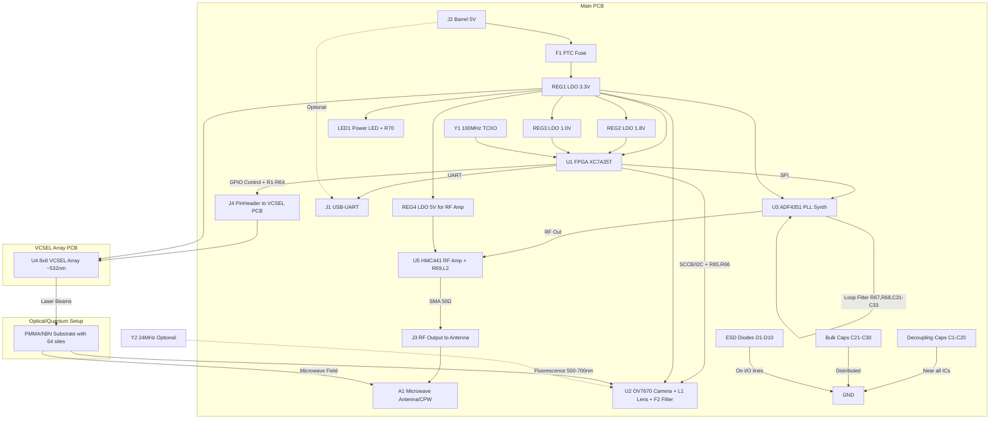

# QNOS: A Qiskit Backend for Solid-State Spin Defects 
(WIP)
QNOS is a hardware-software framework for demonstrating quantum computing principles using spin defects like hexagonal Boron Nitride (hBN) , NV Diamosnd, SiC or Quarz oxigen vacacy as qubits. This project integrates an FPGA-based control system with a laser array for excitation, a camera for optical readout, and microwave pulses for qubit manipulation. It specializes in Quantum Fourier Transform (QFT) for period finding in number theory problems, such as Shor's algorithm components.

The system uses a 64-qubit array (8x8 grid) hosted on a PMMA substrate with hBN defects. Control is achieved via an Xilinx Artix-7 FPGA, with Python software for high-level operations, including integration with Qiskit for circuit simulation on hardware.

## Features
- **Hardware Control**: FPGA-managed laser firing, camera capture, and microwave pulse generation.
- **Calibration**: Automatic mapping of laser positions to camera pixels for accurate qubit addressing.
- **Qubit Readout**: Optical fluorescence detection using image processing to determine qubit states.
- **QFT Specialization**: Implements QFT-based period finding for integers, approximating quantum phase estimation.
- **CLI Interface**: Command-line tool for calibration and calculations using Click.
- **Modular Design**: Separate PCBs for main logic and VCSEL array, with optical setup for hBN substrate.

## Hardware Requirements
The system requires custom hardware assembly. Below is a detailed Bill of Materials (BOM) based on the components list.


## Materials

| Nº   | Component                           | Reference | Value / Model                        | Quantity | Main Function                                                                     | Typical Footprint (KiCad)     | Notes / Important Observations                                                                    |
|------|-------------------------------------|-----------|--------------------------------------|----------|-----------------------------------------------------------------------------------|-------------------------------|---------------------------------------------------------------------------------------------------|
| 1    | Xilinx Artix-7 FPGA                 | U1        | XC7A35T-1CPG236C                     | 1        | Central control, signal generation, UART, laser timing and RF synthesizer        | CSG236 (BGA 236 balls, 0.8 mm pitch) | System core. Power: 1.0 V core, 1.8 V auxiliaries, 3.3 V I/O. SPI interface for ADF4351.         |
| 2    | High-Resolution Image Sensor        | U2        | Consumer-grade 50-200MP sensor       | 1        | High-resolution fluorescence capture for ≥48 qubit discrimination                 | Bare sensor or dev board      | **Options**: Samsung ISOCELL HP1/HP3 (200MP, 12000×9248), Sony IMX461 (100MP), Sony IMX455 (61MP). Higher resolution enables larger qubit grids (up to 48×48). Use macro lens or microscope objective for focusing. |
| 3    | Microwave PLL Synthesizer           | U3        | ADF4351BCPZ                          | 1        | Generation of RF pulses for spin manipulation (35 MHz–4.4 GHz, supports 2–3 GHz) | LFCSP-32 5×5 mm P0.5 mm     | 3.3 V power. SPI interface. REF_IN clock up to 250 MHz. Supports fast hopping for pulses. Output ~0 dBm. |
| 4    | 8×8 VCSEL Array (Custom PCB)        | U4        | 8×8 VCSEL Array (~532 nm, custom PCB)| 1        | Sequential illumination of the 64 hBN sites                                       | Custom PCB with PinHeader 2×8 / 4×4 grid | Each VCSEL ≈5 mA, Vf ≈2.0–2.2 V. Separate PCB connected via J4. Coherent array preferable.       |
| 5    | Limiting Resistors (VCSEL)          | R1–R64    | 270 Ω ±1% 1/10 W                     | 64       | Current limitation per VCSEL (3.3 V – 2.0 V) / 5 mA ≈260 Ω →270 Ω                | 0603 (1608 metric)           | One per each VCSEL diode. 1% tolerance for brightness uniformity.                                 |
| 6    | SCCB/I²C Pull-up Resistors          | R65, R66  | 4.7 kΩ ±1% 1/10 W                    | 2        | Pull-up for SCL and SDA lines of OV7670                                           | 0603                          | Essential for stable communication with the camera.                                               |
| 7    | ADF4351 Loop Filter Resistor        | R67       | 1 kΩ ±1% 1/10 W                      | 1        | Part of the PLL loop filter network (R1)                                          | 0603                          | For ~50 kHz bandwidth, combined with C31, C32, C33.                                               |
| 8    | ADF4351 Loop Filter Resistor        | R68       | 2.2 kΩ ±1% 1/10 W                    | 1        | Part of the PLL loop filter network (R2)                                          | 0603                          | For 3rd order filter.                                                                             |
| 9    | Ceramic Decoupling Capacitors       | C1–C20    | 100 nF (0.1 µF) X7R 16 V             | 20       | High-frequency decoupling near power pins                                         | 0603                          | Place as close as possible to each VCC/GND pin of FPGA, OV7670, ADF4351 and RF amplifier.         |
| 10   | Bulk Ceramic Capacitors             | C21–C30   | 10 µF X7R 16 V                       | 10       | Stabilization of main rails and energy storage                                    | 1206 or 1210                  | Distribute strategically, especially near regulators and FPGA.                                    |
| 11   | ADF4351 Loop Filter Capacitor       | C31       | 220 pF NP0 50 V                      | 1        | PLL loop filter network (C1)                                                      | 0603                          | Value for ~50 kHz bandwidth.                                                                      |
| 12   | ADF4351 Loop Filter Capacitor       | C32       | 10 nF X7R 50 V                       | 1        | PLL loop filter network (C2)                                                      | 0603                          | Combined with R67, R68, C31, C33.                                                                 |
| 13   | ADF4351 Loop Filter Capacitor       | C33       | 220 pF NP0 50 V                      | 1        | PLL loop filter network (C3)                                                      | 0603                          | For spur attenuation.                                                                             |
| 14   | Main Clock Oscillator               | Y1        | 100 MHz TCXO ±2.5 ppm                | 1        | Master clock for FPGA (derive 24 MHz for OV7670 and REF_IN for ADF4351)           | SMD 5032 / 3225 / HC-49U     | TCXO preferable for temporal stability in quantum applications. Divide for 25 MHz REF_IN if necessary. |
| 15   | 3.3 V LDO Regulator                 | REG1      | AMS1117-3.3 or equivalent            | 1        | Generation of 3.3 V for I/O, VCSEL, peripherals and ADF4351                       | SOT-223 / TO-252              | Minimum current ≥1 A.                                                                             |
| 16   | 1.8 V LDO Regulator                 | REG2      | AMS1117-1.8 or equivalent            | 1        | Power for FPGA core and auxiliaries                                               | SOT-223 / TO-252              | Current ≥1 A. Better DC-DC if high dissipation.                                                   |
| 17   | 1.0 V LDO Regulator                 | REG3      | AMS1117-1.0 or equivalent            | 1        | Power for FPGA core                                                               | SOT-223 / TO-252              | Consult XC7A35T datasheet.                                                                        |
| 18   | USB-UART Connector                  | J1        | USB Micro-B or USB-C (FT232/CP2102)  | 1        | Serial communication with PC                                                      | USB Micro-B 5 pins or USB-C 16 pins | FT232RL recommended for compatibility.                                                            |
| 19   | Power Connector                     | J2        | Barrel jack 5.5×2.1 mm               | 1        | Main input 5 VDC                                                                  | PJ-002AH                      | Recommended source 5 V 3 A.                                                                       |
| 20   | Resettable Fuse (PTC)               | F1        | 2 A PTC                              | 1        | Overcurrent protection on input                                                   | 1206 or radial                | Prevents destruction in case of short circuit.                                                     |
| 21   | Power Indicator LED                 | LED1      | Green LED 0603                       | 1        | Visual indication that the board is powered                                       | LED_0603                      | With series resistor R70 330 Ω.                                                                   |
| 22   | RF Connector for ADF4351 Output     | J3        | SMA female edge-mount                | 1        | Connection of RF_OUT from ADF4351 (after amplifier) to antenna                    | SMA edge-mount PCB            | 50 Ω controlled impedance.                                                                        |
| 23   | Connector for VCSEL Array           | J4        | PinHeader 2×8 male 2.54 mm           | 1        | Flexible connection to VCSEL PCB                                                  | PinHeader_2x08_P2.54mm_Vertical | Allows testing or replacement.                                                                    |
| 24   | Secondary Oscillator 24 MHz (optional) | Y2     | 24 MHz crystal or TCXO               | 1        | Dedicated clock for OV7670 if not derived from FPGA                               | HC-49 / SMD 5032              | Only if FPGA cannot generate stable XCLK.                                                         |
| 25   | PMMA Substrate with hBN             | -         | PMMA with microperforations filled with hBN | 1   | Host for color centers (qubits)                                                   | Non-electronic (optical plate)| Perforations of 1 mm, hBN deposited by evaporation or CVD, fluorescence ~500–700 nm. Place near VCSEL and camera. |
| 26   | RF Amplifier                        | U5        | HMC441LP3E                           | 1        | Amplification of RF signal for sufficient power in spin manipulation (~10-20 dBm) | QFN-16 3×3 mm               | 5 V power (use REG4 if necessary). Frequency 0.1-13 GHz.                                          |
| 27   | 5 V LDO Regulator (for RF amp)      | REG4      | AMS1117-5.0 or equivalent            | 1        | Power for RF amplifier                                                            | SOT-223 / TO-252              | Current ≥500 mA. Optional if derived from 5 V input.                                              |
| 28   | RF Amp Bias Resistor                | R69       | 10 Ω ±1% 1/4 W                       | 1        | Bias for HMC441                                                                   | 0805                          | Typical value; consult datasheet for bias current.                                                |
| 29   | RF Amp Choke Inductor               | L2        | 100 nH ±10%                          | 1        | Choke for DC bias on RF output                                                    | 0603                          | For bias decoupling.                                                                              |
| 30   | Microwave Antenna                   | A1        | Loop antenna or CPW resonator (custom)| 1        | Delivery of microwaves to hBN substrate                                           | Custom SMD or wire            | Designed for 2-3 GHz, placed near the substrate. 50 Ω impedance.                                  |
| 31   | Focusing Lens for Camera            | L1        | M12 lens (compatible OV7670)         | 1        | Focus of fluorescence from hBN to sensor                                          | M12 mount                     | Focal length ~4-6 mm for typical distance.                                                        |
| 32   | Long-Pass Optical Filter            | F2        | Filter >600 nm (e.g., RG610 glass)   | 1        | Filtering of VCSEL excitation, passage of hBN fluorescence                        | Custom holder                 | Improves SNR in readout.                                                                          |
| 33   | ESD Protection Diodes               | D1-D10    | TVS diode ESD5V0 (or equiv.)         | 10       | ESD protection on I/O lines (USB, RF, etc.)                                       | SOD-923                       | One per sensitive line. Clamp voltage 5 V.                                                        |
| 34   | LED Series Resistor                 | R70       | 330 Ω ±1% 1/10 W                     | 1        | Current limitation for LED1                                                       | 0603                          |                                                                                                   |

### System Diagram
The following Mermaid diagram illustrates the system architecture:



## Software Setup

Prerequisites:

- Python 3.8+

- FPGA connected via USB-UART (e.g., /dev/ttyUSB0 on Linux)

## Installation

Clone the repository:

```bash
git clone https://github.com/VABISMO/QNOS-QISKIT.git
cd qnos
pip install -r requirements.txt
```

FPGA Firmware
The FPGA firmware is provided in top_level.v (Verilog). Synthesize and program it onto the Xilinx Artix-7 using Vivado or similar tools. The module handles UART commands, laser control, camera interface, and microwave synthesis via AD9910 (note: code uses AD9910, but BOM specifies ADF4351; adapt as needed).

## Usage
Run the CLI tool:
```bash
python qn.py --help
python qn.py period 15 --a 2 --port /dev/ttyUSB0

```


## Calibration

```bash
python qn.py calibrate --port /dev/ttyUSB0
```

## Simulator 

Add flag ```--mock-hardware``` to command 

```bash 
python qn.py period 15 --a 2 --mock-hardware
```
## Development

Tests: Located in tests/ directory. Run with pytest tests/.
Customization: Extend QFTHardwareBackend for other circuits. Adjust parameters in QubitImageProcessor for better readout accuracy.
Limitations: This is a proof-of-concept; real quantum coherence in hBN defects requires cryogenic conditions and advanced error correction, not implemented here.

## License
APACHE 2 - Non Comercial

