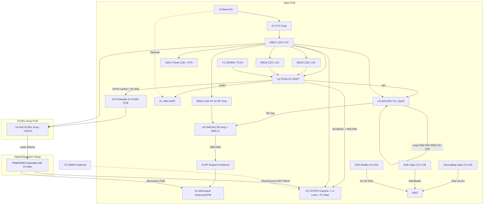

# QNOS: Qiskit Solid-State Spin Defects 
(WIP)
QNOS (Quantum Number Operating System) is a hardware-software framework for demonstrating quantum computing principles using spin defects like hexagonal Boron Nitride (hBN) , NV Diamosnd, SiC or Quarz oxigen vacacy as qubits. This project integrates an FPGA-based control system with a laser array for excitation, a camera for optical readout, and microwave pulses for qubit manipulation. It specializes in Quantum Fourier Transform (QFT) for period finding in number theory problems, such as Shor's algorithm components.

The system uses a 64-qubit array (8x8 grid) hosted on a PMMA substrate with hBN defects. Control is achieved via an Xilinx Artix-7 FPGA, with Python software for high-level operations, including integration with Qiskit for circuit simulation on hardware.

## Features
- **Hardware Control**: FPGA-managed laser firing, camera capture, and microwave pulse generation.
- **Calibration**: Automatic mapping of laser positions to camera pixels for accurate qubit addressing.
- **Qubit Readout**: Optical fluorescence detection using image processing to determine qubit states.
- **QFT Specialization**: Implements QFT-based period finding for integers, approximating quantum phase estimation.
- **CLI Interface**: Command-line tool for calibration and calculations using Click.
- **Modular Design**: Separate PCBs for main logic and VCSEL array, with optical setup for hBN substrate.

## Hardware Requirements
The system requires custom hardware assembly. Below is a detailed Bill of Materials (BOM) based on the components list.

### Bill of Materials (BOM)

| Nº   | Componente                          | Referencia | Valor / Modelo                       | Cantidad | Función principal                                                                 | Footprint típico (KiCad)      | Notas / Observaciones importantes                                                                 |
|------|-------------------------------------|------------|--------------------------------------|----------|-----------------------------------------------------------------------------------|-------------------------------|---------------------------------------------------------------------------------------------------|
| 1    | FPGA Xilinx Artix-7                 | U1         | XC7A35T-1CPG236C                     | 1        | Control central, generación de señales, UART, timing láser y sintetizador RF      | CSG236 (BGA 236 bolas, 0.8 mm pitch) | Núcleo del sistema. Alimentación: 1.0 V core, 1.8 V auxiliares, 3.3 V I/O. Interfaz SPI para ADF4351. |
| 2    | Cámara CMOS Omnivision              | U2         | OV7670 (módulo completo con lente)   | 1        | Captura de fluorescencia de los sitios hBN                                        | QFN-24 4×4 mm P0.4 mm + EPAD | Salida paralela 8 bits, reloj XCLK 24 MHz, interfaz SCCB (I²C-like). Configurar para modo gris para fluorescencia. |
| 3    | Sintetizador PLL para microondas    | U3         | ADF4351BCPZ                          | 1        | Generación de pulsos RF para manipulación de espín (35 MHz–4.4 GHz, soporta 2–3 GHz) | LFCSP-32 5×5 mm P0.5 mm     | Alimentación 3.3 V. Interfaz SPI. Reloj REF_IN hasta 250 MHz. Soporta hopping rápido para pulsos. Salida ~0 dBm. |
| 4    | Matriz de VCSEL 8×8 (PCB propia)    | U4         | Array 8×8 VCSEL (~532 nm, custom PCB)| 1        | Iluminación secuencial de los 64 sitios hBN                                       | Custom PCB con PinHeader 2×8 / 4×4 grid | Cada VCSEL ≈5 mA, Vf ≈2.0–2.2 V. PCB separada conectada via J4. Array coherente preferible. |
| 5    | Resistencias limitadoras (VCSEL)    | R1–R64     | 270 Ω ±1% 1/10 W                     | 64       | Limitación de corriente por VCSEL (3.3 V – 2.0 V) / 5 mA ≈260 Ω →270 Ω           | 0603 (1608 metric)           | Una por cada diodo VCSEL. Tolerancia 1% para uniformidad de brillo. |
| 6    | Resistencias pull-up SCCB/I²C       | R65, R66   | 4.7 kΩ ±1% 1/10 W                    | 2        | Pull-up para líneas SCL y SDA del OV7670                                          | 0603                          | Imprescindibles para comunicación estable con la cámara. |
| 7    | Resistencia loop filter ADF4351     | R67        | 1 kΩ ±1% 1/10 W                      | 1        | Parte de la red de filtro del loop PLL (R1)                                       | 0603                          | Para ancho de banda ~50 kHz, combinado con C31, C32, C33. |
| 8    | Resistencia loop filter ADF4351     | R68        | 2.2 kΩ ±1% 1/10 W                    | 1        | Parte de la red de filtro del loop PLL (R2)                                       | 0603                          | Para filtro de 3er orden. |
| 9    | Capacitores cerámicos de desacoplo  | C1–C20     | 100 nF (0.1 µF) X7R 16 V             | 20       | Desacoplo de alta frecuencia cerca de pines de alimentación                       | 0603                          | Colocar lo más cerca posible de cada pin VCC/GND del FPGA, OV7670, ADF4351 y amplificador RF. |
| 10   | Capacitores cerámicos bulk          | C21–C30    | 10 µF X7R 16 V                       | 10       | Estabilización de rieles principales y almacenamiento de energía                   | 1206 o 1210                   | Distribuir estratégicamente, especialmente cerca de reguladores y FPGA. |
| 11   | Capacitor loop filter ADF4351       | C31        | 220 pF NP0 50 V                      | 1        | Red de filtro del loop PLL (C1)                                                   | 0603                          | Valor para ~50 kHz bandwidth. |
| 12   | Capacitor loop filter ADF4351       | C32        | 10 nF X7R 50 V                       | 1        | Red de filtro del loop PLL (C2)                                                   | 0603                          | Combinado con R67, R68, C31, C33. |
| 13   | Capacitor loop filter ADF4351       | C33        | 220 pF NP0 50 V                      | 1        | Red de filtro del loop PLL (C3)                                                   | 0603                          | Para atenuación de spurs. |
| 14   | Oscilador de reloj principal        | Y1         | 100 MHz TCXO ±2.5 ppm                | 1        | Reloj maestro del FPGA (deriva 24 MHz para OV7670 y REF_IN para ADF4351)         | SMD 5032 / 3225 / HC-49U     | TCXO preferible para estabilidad temporal en aplicaciones cuánticas. Dividir para 25 MHz REF_IN si necesario. |
| 15   | Regulador LDO 3.3 V                 | REG1       | AMS1117-3.3 o equivalente            | 1        | Generación de 3.3 V para I/O, VCSEL, periféricos y ADF4351                        | SOT-223 / TO-252              | Corriente mínima ≥1 A. |
| 16   | Regulador LDO 1.8 V                 | REG2       | AMS1117-1.8 o equivalente            | 1        | Alimentación núcleo y auxiliares FPGA                                             | SOT-223 / TO-252              | Corriente ≥1 A. Mejor DC-DC si disipación alta. |
| 17   | Regulador LDO 1.0 V                 | REG3       | AMS1117-1.0 o equivalente            | 1        | Alimentación núcleo FPGA                                                          | SOT-223 / TO-252              | Consultar datasheet XC7A35T. |
| 18   | Conector USB-UART                   | J1         | USB Micro-B o USB-C (FT232/CP2102)   | 1        | Comunicación serie con PC                                                         | USB Micro-B 5 pines o USB-C 16 pines | Recomendado FT232RL para compatibilidad. |
| 19   | Conector de alimentación            | J2         | Barrel jack 5.5×2.1 mm               | 1        | Entrada principal 5 VDC                                                           | PJ-002AH                      | Fuente recomendada 5 V 3 A. |
| 20   | Fusible reseteable (PTC)            | F1         | 2 A PTC                              | 1        | Protección contra sobrecorriente en entrada                                       | 1206 o radial                 | Evita destrucción en caso de cortocircuito. |
| 21   | LED indicador de alimentación       | LED1       | LED verde 0603                       | 1        | Indicación visual de que la placa está alimentada                                 | LED_0603                      | Con resistencia serie R70 330 Ω. |
| 22   | Conector RF para salida ADF4351     | J3         | SMA hembra edge-mount                | 1        | Conexión de salida RF_OUT del ADF4351 (tras amplificador) a antena                | SMA edge-mount PCB            | 50 Ω impedancia controlada. |
| 23   | Conector para matriz VCSEL          | J4         | PinHeader 2×8 macho 2.54 mm          | 1        | Conexión flexible a la PCB VCSEL                                                  | PinHeader_2x08_P2.54mm_Vertical | Permite pruebas o reemplazo. |
| 24   | Oscilador secundario 24 MHz (opcional) | Y2      | 24 MHz cristal o TCXO                | 1        | Reloj dedicado para OV7670 si no se deriva del FPGA                               | HC-49 / SMD 5032              | Solo si el FPGA no puede generar XCLK estable. |
| 25   | Sustrato PMMA con hBN               | -          | PMMA con microperforaciones rellenas de hBN | 1   | Hospedador de los centros de color (qubits)                                       | No electrónico (placa óptica) | Perforaciones de 1 mm, hBN depositado por evaporación o CVD, fluorescencia ~500–700 nm. Colocar cerca de VCSEL y cámara. |
| 26   | Amplificador RF                     | U5         | HMC441LP3E                           | 1        | Amplificación de señal RF para potencia suficiente en manipulación de espín (~10-20 dBm) | QFN-16 3×3 mm               | Alimentación 5 V (usar REG4 si necesario). Frecuencia 0.1-13 GHz. |
| 27   | Regulador LDO 5 V (para amp RF)     | REG4       | AMS1117-5.0 o equivalente            | 1        | Alimentación para amplificador RF                                                 | SOT-223 / TO-252              | Corriente ≥500 mA. Opcional si se deriva de entrada 5 V. |
| 28   | Resistencia bias amp RF             | R69        | 10 Ω ±1% 1/4 W                       | 1        | Bias para HMC441                                                                  | 0805                          | Valor típico; consultar datasheet para corriente de bias. |
| 29   | Inductor choke amp RF               | L2         | 100 nH ±10%                          | 1        | Choke para bias DC en salida RF                                                   | 0603                          | Para decoupling bias. |
| 30   | Antena microondas                   | A1         | Antena loop o CPW resonator (custom) | 1        | Entrega de microondas al sustrato hBN                                             | Custom SMD o wire             | Diseñada para 2-3 GHz, colocada cerca del sustrato. Impedancia 50 Ω. |
| 31   | Lente de enfoque para cámara        | L1         | Lente M12 (compatible OV7670)        | 1        | Enfoque de fluorescencia desde hBN a sensor                                       | M12 mount                     | Focal length ~4-6 mm para distancia típica. |
| 32   | Filtro óptico long-pass             | F2         | Filtro >600 nm (e.g., RG610 glass)   | 1        | Filtrado de excitación VCSEL, paso de fluorescencia hBN                           | Custom holder                 | Mejora SNR en readout. |
| 33   | Diodos de protección ESD            | D1-D10     | TVS diode ESD5V0 (o equiv.)          | 10       | Protección ESD en líneas I/O (USB, RF, etc.)                                      | SOD-923                       | Uno por línea sensible. Voltaje clamp 5 V. |
| 34   | Resistencia serie LED               | R70        | 330 Ω ±1% 1/10 W                     | 1        | Limitación corriente para LED1                                                    | 0603                          | Calculado para 3.3 V, ~5 mA. |

### System Diagram
The following Mermaid diagram illustrates the system architecture:



## Software Setup

Prerequisites:

- Python 3.8+

- FPGA connected via USB-UART (e.g., /dev/ttyUSB0 on Linux)

## Installation

Clone the repository:

```bash
git clone https://github.com/VABISMO/QNOS-QISKIT.git
cd qnos
pip install -r requirements.txt
```

FPGA Firmware
The FPGA firmware is provided in top_level.v (Verilog). Synthesize and program it onto the Xilinx Artix-7 using Vivado or similar tools. The module handles UART commands, laser control, camera interface, and microwave synthesis via AD9910 (note: code uses AD9910, but BOM specifies ADF4351; adapt as needed).

## Usage
Run the CLI tool:
```bash
python qnos.py --help
python qnos.py calculate-period 15 --a 2 --port /dev/ttyUSB0

```
## Calibration

```ash
python qn.py calibrate --port /dev/ttyUSB0
```

## Development

Tests: Located in tests/ directory. Run with pytest tests/.
Customization: Extend QFTHardwareBackend for other circuits. Adjust parameters in QubitImageProcessor for better readout accuracy.
Limitations: This is a proof-of-concept; real quantum coherence in hBN defects requires cryogenic conditions and advanced error correction, not implemented here.

## License
APACHE 2 - Non Comercial

